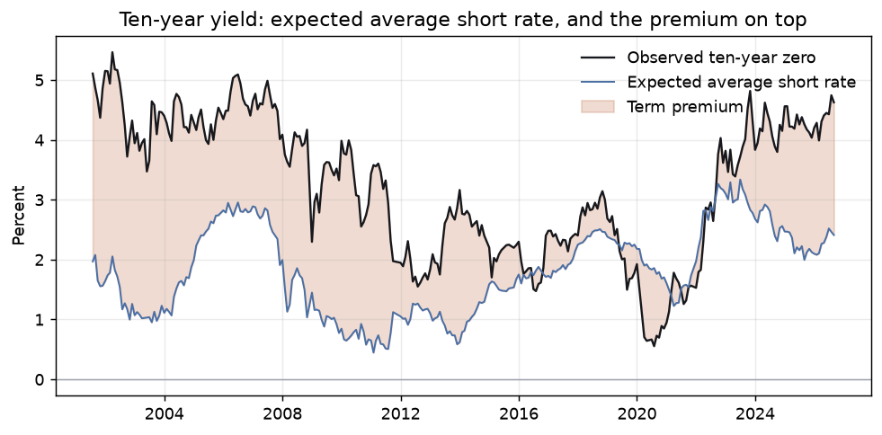

# rates-lab

What the yield curve prices: the policy path, the inflation path, and the term premium —
kept apart from each other rather than read off a forward rate and called an expectation.




**In short**

- On 2026-07-31 the ten-year zero rate of 4.74% splits into 2.47% expected short rate and 2.28% term premium (Adrian-Crump-Moench, 301 monthly curves since 2001).
- The premium tracks the Fed's Kim-Wright estimate in levels (correlation 0.921, against 0.850 for the yield alone) but not in monthly changes, and sits about a point above it.
- The bootstrap reprices every published par yield to 0.1 bp; the Svensson curve matches the ECB's published parameters to 1e-6.

Rendered report: <https://emiliensabathier.github.io/rates-lab/>

## Results

US Treasury constant maturities, 301 month-end curves from 2001-07 to 2026-07, each dated by
the day its quotes printed, bootstrapped and decomposed by Adrian-Crump-Moench. No month was
refused.

**What the estimate gets right is the shape of the ten-year term premium over the years, not
its level, and not its month-to-month moves.** The check is the Federal Reserve Board's
Kim-Wright premium, compared on the same day, with a naive benchmark next to it: the same
correlation using the ten-year yield itself in place of the model's premium.

| Correlation with Kim-Wright | ACM premium | Ten-year yield (naive) |
| --- | --- | --- |
| Levels | 0.921 | 0.850 |
| Monthly changes | 0.828 | 0.946 |

- **In levels the model beats the naive benchmark.** The decomposition carries something the
  yield alone does not: the premium compressed through the QE decade and reopened after
  2022, and Kim-Wright saw the same thing.
- **In monthly changes it loses.** Kim-Wright books most of any monthly yield move as
  premium, so the yield alone tracks it better than this estimate does. A 0.828 correlation in
  changes is not evidence that the model separates premium from expectations month by month,
  and it is not quoted as such.
- **The level disagrees by about a point.** This estimate runs +0.98 pp above Kim-Wright on
  average, +1.41 pp on the latest date. See Limitations for what that gap is and is not.

The latest decomposition, ten-year zero rate on 2026-07-31:
**4.74% = 2.47% expected + 2.28% premium**, against a Kim-Wright premium of 0.87% the same
day. Both models put a positive premium in the yield, so quoting the yield as the market's
view of the average short rate quotes some premium as a forecast; how much is where they
disagree, and this split should be read as indicative.

| Other figures | Value |
| --- | --- |
| Three principal components of monthly curve changes explain | 99.00% of variance |
| ACM cross-sectional fit, mean over the panel | 1.64 bp |
| Ten-year spot breakeven / 5y5y forward breakeven | 2.27% / 2.30% |
| Months refused because the quotes implied a negative forward | 0 of 301 |

Full report with charts, the policy path and breakevens:
[`reports/rates.html`](reports/rates.html).

## The point

A ten-year yield is not a forecast of the average overnight rate. A ten-year breakeven is
not expected inflation. A two-year forward is not "two cuts priced in". Each of those
sentences is a decomposition being skipped, and each is a mistake that survives because the
number it produces still sounds like an answer.

This package does the decompositions instead:

```
CMT par yields ──bootstrap──> zero curve ──┬──> policy path      (forward rates)
                                           ├──> breakeven        (nominal − real)
                                           ├──> PCA              (level, slope, curvature)
                                           └──> ACM              (expectations + premium)
```

Every stage says what it is not, in the module docstring, at the point where a reader would
otherwise assume otherwise.

## What the numbers are checked against

Nothing here is checked against a figure this repository invented.

| Claim | Check | Result |
| --- | --- | --- |
| The Svensson form is the ECB's | Regenerate the ECB's published spot rates from the ECB's own published parameters, 2026-08-06 | Agrees to 1e-6 percentage points, at every published tenor |
| The bootstrap is a bootstrap | Reprice each par bond from the solved discount factors | Every published par yield recovered to 0.1 bp |
| The curve fit is stable | Refit the ECB curve from its own pillars and compare curves, not parameters | Worst pillar under 1 bp |
| ACM inverts the model it assumes | Estimate on panels generated by the affine model with a known ten-year premium of about 1.3 points, 20 seeds | On 1200 months: mean error −6 bp, standard deviation 42 bp. On 300 months, the real sample's length: standard deviation 73 bp |
| ACM prices the cross-section | Reprice a noiseless panel from the estimated factors | Under 1 bp at the worst maturity |
| The term premium tracks a published one | Correlate against the Federal Reserve Board's Kim-Wright ten-year premium, same day, 301 months, next to the ten-year yield as a naive benchmark | 0.921 in levels (yield: 0.850), 0.828 in monthly changes (yield: 0.946) |

The Svensson, curve-fit and Kim-Wright checks compare against a published third party, not a
fixture. The ACM checks compare against a generator written out separately from the
estimator, from the pricing equations, so a shared sign error cannot make both agree and
pass.

Kim-Wright is a different specification fitted by Kalman filter rather than by regression,
which is what makes the comparison worth anything: two models sharing an assumption would
agree for the wrong reason.

## Conventions that decide whether the code is right

Three places where a plausible implementation is silently wrong, all of them load-bearing:

- **Par yields are not zero rates.** A five-year CMT of 4.33% is the coupon a five-year
  Treasury would carry to price at par. Discounting with it directly is the most common way
  to get a curve wrong. `curve/bootstrap.py` solves the discount factors that reprice each
  par bond exactly, honouring the Treasury's quoting conventions: simple interest on bills
  to six months, semiannual compounding at one year, semiannual coupons beyond, on a regular
  half-year schedule with no day count.
- **The price of risk is not scaled twice.** In ACM the risk-neutral dynamics are
  `mu - lambda0` and `phi - lambda1`. The excess-return regression already returns lambda in
  those units. Multiplying by the innovation covariance a second time shrinks the premium by
  five orders of magnitude, and the decomposition then prints a flat zero at every maturity —
  which looks exactly like a working model.
- **Which curve is which.** `fitted` is priced under the risk-adjusted (Q) dynamics and
  reproduces the observed panel. `expectations` is the counterfactual with the price of risk
  switched off, priced under the physical (P) dynamics; it is the expectations component and
  it is *supposed* to differ from the data. ACM call the second one the "risk-neutral yield",
  which is why the code does not: swapping the two produces a term premium with the wrong
  sign.

## Limitations

Stated because they matter more than the outputs.

- **A breakeven is not expected inflation.** It is expected inflation, plus an inflation risk
  premium, minus a TIPS liquidity premium. Nothing public separates the three. A breakeven of
  2.3% is what the market charges, not what the market expects. `inflation.py` says so in its
  docstring and the number is never labelled otherwise.
- **On a sample this short the ACM premium is wide, and that is measured, not assumed.** On
  synthetic panels of 300 months generated with *no* price of risk, the ten-year estimate
  averages −19 bp with a standard deviation of 73 bp, from −136 to +99 bp across 20 seeds. On
  1200 months the error shrinks to −6 bp on average. Read the ten-year premium as ±75 bp, not
  as a point value. The error has no upward tilt, so it widens the band around the estimate
  but does not explain the gap to Kim-Wright below.
- **The level sits about a point above Kim-Wright, and that is the largest single caveat on
  this page.** The mean gap is +0.98 pp and the latest +1.41 pp. It is not constant: it nearly
  closes over the middle of the sample and is widest before 2012 and since 2023. Sampling error
  does not account for it (bullet above). The most likely source is the difference between the
  models: Kim-Wright anchors its expected short-rate path to survey forecasts, while ACM has no
  anchor but the sample, so its expected path reverts toward the sample's average one-month
  rate of 1.72%. That is a hypothesis; it is not tested here. Read the shape, not the level.
- **The parameters are estimated on the full sample.** The premium reported for 2008 uses the
  VAR and prices of risk estimated with data through 2026, so this is a historical
  decomposition, not one that could have been computed in real time, and it is not a
  backtestable signal.
- **The cross-section carries nine independent points, not a hundred and twenty.** The monthly
  grid is sampled from a monotone cubic interpolated on log discount factors between the nine
  published CMT pillars. The 1.64 bp mean fit is the model fitting an interpolation, and it
  would be dishonest to quote it as though a hundred and twenty separate quotes had been
  repriced. The same goes for the policy path between pillars: on a curve linear in zero
  rates it would rise in identical steps between pillars and jump at each one, which reads
  as a policy view and is only the interpolant.
- **No month is missing, and a gap would not be bridged.** A month is refused when its quotes
  imply a negative forward rate. On the monotone curve none of the 301 does; a zero forward,
  as when the bills printed 0.00%, is accepted. If a month were refused, the VAR and the
  excess-return regression would skip the pair of observations that straddles the gap rather
  than treat a two-month step as one.
- **The grid stops at ten years**, so nothing here says anything about the thirty-year point.
  That is deliberate: the twenty- and thirty-year CMT series carry the 2002-2006 gap when the
  bond was not issued, and requiring them would delete four years of history to buy maturities
  the decomposition does not use.
- **ACM needs a monthly maturity grid.** A one-month holding period turns an n-month bond into
  an (n-1)-month bond, and that leg has to exist rather than be interpolated off a six-pillar
  grid. `estimate` raises if it is handed anything else, rather than interpolating quietly.
- **The euro curve starts at three months.** The ECB does not publish a one-month pillar — the
  endpoint returns 404 — so nothing downstream may assume one.
- **The real curve starts in 2003, and its thirty-year point in 2010.** Asking for a breakeven
  outside the window the TIPS series actually covers raises, rather than returning a number
  built from an extrapolation.
- **The euro side has no pipeline.** `data/ecb.py` and the Svensson fitter exist and are
  tested against the ECB's own published curve, but the report is built from US Treasury data
  only. The euro AAA curve starts at three months, which the ACM grid cannot use without an
  assumption about the missing one-month pillar, and inventing one is not worth a second
  headline number.

## Reproducing the figures

The committed `reports/rates.html` is rendered from a frozen FRED capture
(`tests/fixtures/fred/`, captured 2026-08-17) by `scripts/build_frozen_report.py`, and a test
asserts the committed page and a freshly rendered one are identical outside the chart images.
Every headline figure above is written out as a literal in `tests/test_pipeline.py` and
compared value by value, including the level gap and the naive benchmarks — there are tests
whose only job is to fail if the gap ever closes or the naive benchmark stops beating the
model in changes, so neither caveat can go stale while the page still carries it.

Each month is dated by the last day its quotes printed, not by a calendar label, and a final
month that had not finished trading at capture time is dropped: the 2026-08-17 capture ends
at 2026-07-31.

```bash
python -m pip install -e ".[dev]"
python -m pytest
python -m ruff check src tests scripts

python -m rlab --refresh                  # live pull, writes reports/rates.local.html
python scripts/build_frozen_report.py     # offline, rebuilds the committed page
python scripts/capture_fixture.py         # re-freeze the capture, deliberately
```

A live run never overwrites the committed report. It writes `rates.local.html`, because
overwriting the committed page would silently break the identity test that makes it
trustworthy. `python -m rlab` exits non-zero when any month was refused, so a script that
only checks the exit code cannot mistake a partial panel for a clean one.

The tests run offline. Both loaders take an injected fetcher, so parsing is tested against
captured payloads and no test depends on FRED or the ECB being up; the tests that would hit
the network are marked `network` and deselected by default.

## Related

Four companion studies, same method: a frozen capture, a rendered report, and a
limitations section longer than the results.

- [valuation-lab](https://github.com/emiliensabathier/valuation-lab) — what a share price already assumes, by inverting a DCF
- [credit-lab](https://github.com/emiliensabathier/credit-lab) — which default score flags first, against real credit events
- [portfolio-lab](https://github.com/emiliensabathier/portfolio-lab) — whether any allocation rule beats a static 60/40
- [options-lab](https://github.com/emiliensabathier/options-lab) — what S&P 500 implied volatility prices: an arbitrage-free surface and the variance premium

## Licence

MIT.
